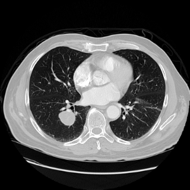
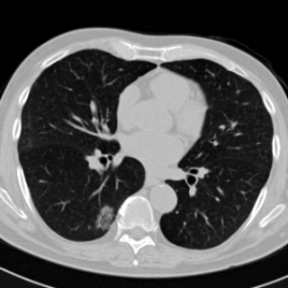
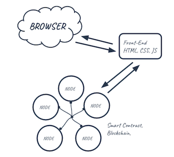
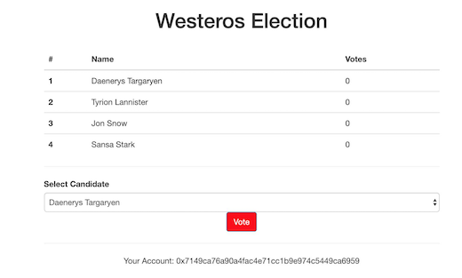
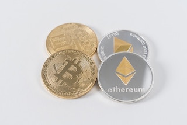

<a href="https://www.linkedin.com/in/plengnakdee/">View My LinkIn Profile</a>

<a href="https://github.com/PlengNakdee/plengnakdee.github.io/blob/master/Resume_2019.pdf">View My Resume</a>

# Project

Here are some of my projects.

## Deep Learning

Using deep learning to determine whether a nodule is malignant or not.

## Blockchain

Simulate an election application with blockchain.

## Trading Bot

A simple cryptocurrency trading bot.

